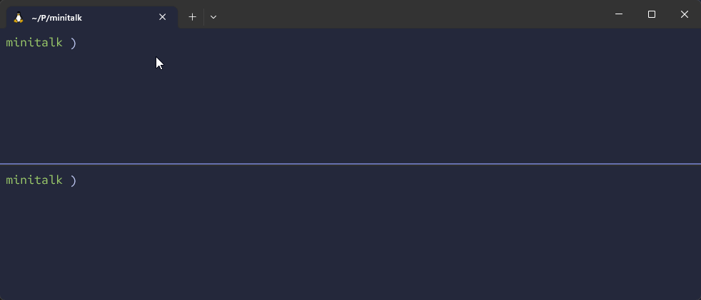

# Minitalk



## What is it?
A project to gain a better understanding of how processes communicate with each other using [POSIX signals](https://en.wikipedia.org/wiki/Signal_(IPC)).  

It consists of two programs: a server and a client.
The client is capable of sending text messages to the server, and the server displays them.

This communication is made using only [POSIX signals](https://en.wikipedia.org/wiki/Signal_(IPC)) (e.g., SIGUSER1 and SIGUSER2) and is possible by the client sending the text message bit by bit and then reconstructing the text on the server.

**Succeeded with 115%**

## Skills
- Rigor
- Unix logic

## How to use it
Requirements:
```shell
sudo apt install clang
```

Clone the repository and run:
```shell
make
```

Both the server and client will be generated, after that, you can run the server in the background.
```shell
./server &
```

Its PID will be printed, and with that, you can execute the client, passing the PID and a string.
```shell
./client <PID> "Oh my gah!"
```

## Found any bugs?
Feel free to contact me or create an issue!


## License
This project is licensed under the GNU General Public License v3.0 - see the [COPYING](https://github.com/hde-oliv/minitalk/blob/master/COPYING) file for details.

